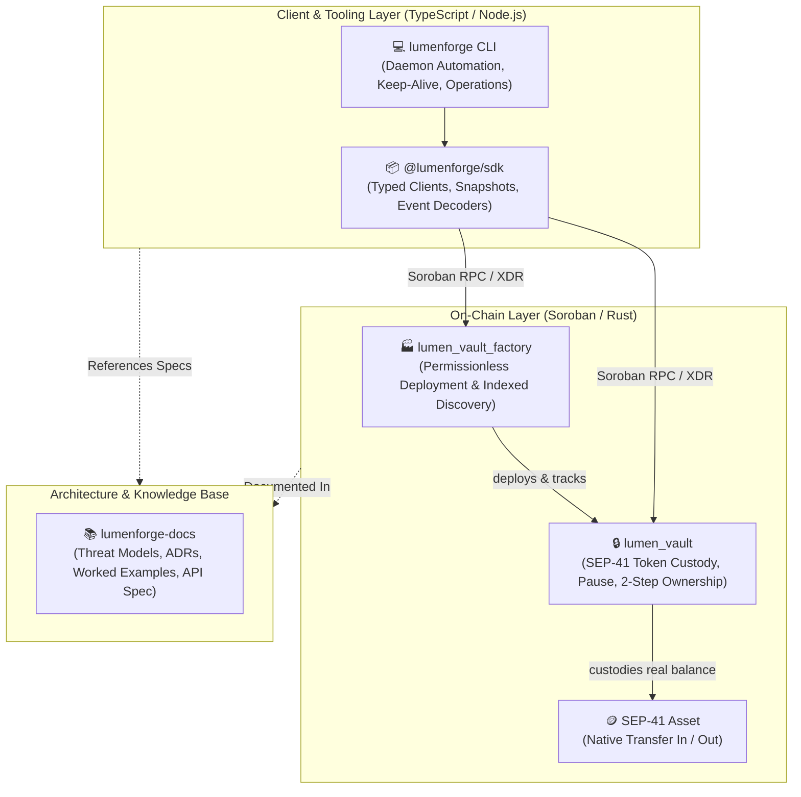

<div align="center">

# 🌟 StellarCrove

### Modular Soroban Vault Infrastructure & Developer Tooling for the Stellar Ecosystem

[](https://stellar.org)
[](https://github.com/StellarCrove/lumenforge-contracts)
[](https://github.com/StellarCrove/lumenforge-sdk)
[](https://github.com/StellarCrove/lumenforge-docs)

<br/>

**StellarCrove** builds robust, formally reasoned, and audit-grade smart contract systems on the Stellar network.  
Our flagship initiative, **LumenForge**, provides self-contained asset custody vaults, permissionless factory indexing, and ergonomic TypeScript tooling for developers and institutional integrators.

---

</div>

## 🌌 The LumenForge Ecosystem

LumenForge separates concerns cleanly across three open-source repositories designed to operate seamlessly together:



### 📦 Core Repositories

| Repository | Description | Primary Languages & Tools |
| :--- | :--- | :--- |
| [`lumenforge-contracts`](https://github.com/StellarCrove/lumenforge-contracts) | Smart contracts implementing `lumen_vault` and `lumen_vault_factory`. Features atomic constructor initialization, safe balance arithmetic, deposit bounds, wrong-asset rescue, and two-step ownership handover. | Rust, Soroban SDK v27, `wasm32v1-none` |
| [`lumenforge-sdk`](https://github.com/StellarCrove/lumenforge-sdk) | Client library and CLI for connecting to vaults, deploying via factory with deterministic or random salts, decoding raw events, snapshotting contract states, and automating off-chain TTL keeper renewals. | TypeScript, Node.js ≥ 22, `@stellar/stellar-sdk` |
| [`lumenforge-docs`](https://github.com/StellarCrove/lumenforge-docs) | Central documentation portal covering full system architecture, threat models, token vetting checklists, CLI recipes (cron, systemd, GitHub Actions), and ADR rationale. | Markdown, Architecture Decision Records (ADRs) |

---

## 🛡️ Architectural Principles & Security Foundations

LumenForge smart contracts are architected following defensive security invariants:

1. **Atomic Constructor Initialization**: Contracts configure owner, custodied token, and deposit bounds directly in `__constructor` at deployment time, entirely eliminating front-running vulnerabilities during initialization.
2. **True Asset Custody**: Vault balances represent verified SEP-41 token balances transferred to the contract address—not unbacked internal accounting tallies.
3. **Two-Step Ownership Transfer**: Ownership handover requires explicit proposal (`propose_owner`) followed by cryptographic acceptance by the recipient (`accept_owner`), with cancellation support (`cancel_pending_owner`) preventing accidental key-loss bricking.
4. **Bounded Storage Footprint**: The factory contract enforces strict per-owner limits (`MAX_VAULTS_PER_OWNER = 100`) and paginated views to guarantee constant-cost write operations and prevent unbounded state bloat.
5. **Off-Chain Keep-Alive Ecosystem**: Because Soroban storage requires periodic rent/TTL renewal, the SDK includes first-class TTL keeper routines (`keepAlive`, `keepOwnerVaultsAlive`) for seamless automation.

---

## 🚀 Quick Start (TypeScript SDK)

Install the client library:

```bash
npm install @lumenforge/sdk
```

Connect to a vault and inspect live state in seconds:

```typescript
import { connectVault, getVaultSnapshot } from "@lumenforge/sdk";

// Initialize vault client
const vault = await connectVault({
  contractId: "CA7...VAULT_CONTRACT_ID...",
  networkPassphrase: "Test SDF Network ; September 2015",
  rpcUrl: "https://soroban-testnet.stellar.org",
  publicKey: "GA...OWNER_PUBLIC_KEY...",
});

// Fetch unified snapshot in a single batch
const { balance, owner, paused, minDeposit, maxBalance } = await getVaultSnapshot(vault);
console.log(`Vault Balance: ${balance} | Owner: ${owner} | Paused: ${paused}`);
```

---

## 🤝 Contributing & Community

We welcome contributions across smart contracts, SDK tooling, documentation, and formal verification!

- Read our [`CONTRIBUTING.md`](./CONTRIBUTING.md) to get familiar with our developer workflow.
- All contributors are expected to adhere to our [`CODE_OF_CONDUCT.md`](./CODE_OF_CONDUCT.md).
- To report security concerns, please refer to our private security disclosure guidelines in [`lumenforge-contracts/docs/security.md`](https://github.com/StellarCrove/lumenforge-contracts/blob/main/docs/security.md).

---

<div align="center">
  <sub>Maintained by the <b>StellarCrove</b> Core Engineering Team. Built with ❤️ for the Stellar decentralized ecosystem.</sub>
</div>
